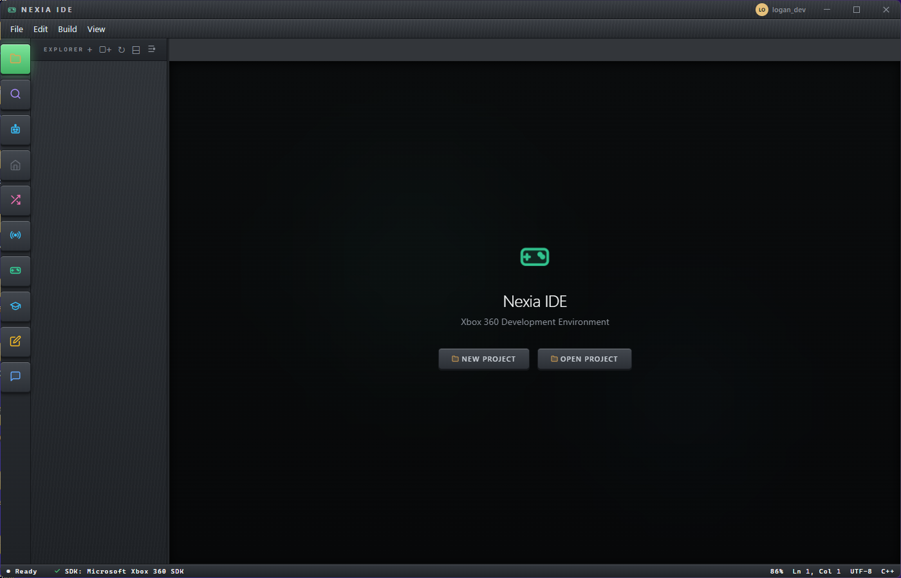

<h1 align="center">Nexia IDE</h1>

<p align="center">
  <strong>A standalone development environment for Xbox 360 homebrew.</strong><br>
  No Visual Studio required — just install and start building.
</p>

<p align="center">
  <a href="#features">Features</a> •
  <a href="#getting-started">Getting Started</a> •
  <a href="#building-from-source">Build from Source</a> •
  <a href="#architecture">Architecture</a> •
  <a href="#keyboard-shortcuts">Shortcuts</a> •
  <a href="#license">License</a>
</p>

---

<p align="center">
  
</p>

## Features

**Code Editor** — Full Monaco-based editor with Xbox 360 C++ syntax highlighting, IntelliSense for XDK APIs, tab management, inline AI hints, and a Visual Studio–style Solution Explorer.

**One-Click Build System** — Compile, link, and package `.xex` executables and dynamic libraries directly from the IDE. Supports Debug, Release, and Profile configurations with real-time MSBuild-style output. Incremental and parallel compilation, response files for large projects, and full Project Properties matching VS2010 Xbox 360 property pages.

**Project Templates** — Title (.xex), Dynamic Library (.xex), Static Library (.lib), spinning cube demo, XUI application, and XBLA title scaffold with networking and achievements.

**Visual Studio Import** — Bring existing work across with `File → Import from Visual Studio (.sln)`. Reads `.sln` solutions and both project formats the XDK shipped against (`.vcxproj` and legacy `.vcproj`), carrying over sources, include paths, library paths, libraries, preprocessor defines, precompiled header, RTTI, exception handling, warning level and optimization. Multi-project solutions let you pick. Your files are **copied, never moved**, so the Visual Studio project keeps working — and a preview shows exactly what will come over before anything is written.

**SDK Tools** — Integrated access to shader compiler (fxc), audio encoder (xma2encode), XUI compiler, binary inspector, PIX profiler launcher, and more — all without leaving the IDE.

**Devkit Management** — Connect to a development kit over the network. Deploy builds, reboot the console, capture screenshots, browse the file system, and monitor CPU/memory usage.

**Emulator Integration (Nexia 360)** — Launch and debug your builds in an emulator. Set breakpoints, inspect registers, step through code, read/write memory, and view backtraces. Requires Windows 10+.

**AI Tutor** — Multi-provider AI assistant (Anthropic, OpenAI, Ollama, custom endpoints) with streaming responses, code generation, inline explain/fix/refactor actions, and proactive tutoring that adapts to your skill level.

**Cinematic Learning System** — 17 interactive lessons across 8 modules covering C++ fundamentals through Xbox 360 specifics (Xenon architecture, Direct3D 9, XInput). Typing animations, token explanations, connection diagrams, adaptive mastery tracking with spaced repetition, quizzes, flashcards, study notes, and achievements.

**Cloud Lessons & Progress Sync** — Browse, download and update community lessons straight from the Learn panel, with version-aware update badges. Sign in and your mastery profile follows you across machines, merging rather than overwriting.

**Genesis Lab** — Self-evolving AI lesson engine that generates, critiques, and refines lessons through iterative evolution. Persistent across sessions with HTML export.

**Code Visualizer** — Flow charts, class diagrams, and memory layouts rendered on Canvas 2D. AI responses can trigger visualizations automatically.

**XEX Inspector** — Parse and display Xbox 360 executable headers, base address, entry point, imports, and exports.

**Git Integration** — Initialize repos, stage, commit, diff, log, branch, merge, and push/pull to GitHub with token authentication.

**Discord Community** — Built-in Discord feed to browse threads, post questions, and share downloads without leaving the IDE.

**Extensions** — Install community tools, templates, snippet packs, themes, and plugins from `.zip` files or folders.

**Skins** — Three structural skins that restyle the interface itself, not just the accent colour (`Settings → Appearance`): **Blade** (the 2005 Xbox 360 dashboard — sliding blades and ring-of-light glow), **Devkit** (the IDE as hardware — brushed chassis, keycap rail, status LEDs), and **Phosphor** (CRT terminal — monospace, scanlines, phosphor bloom). Colour presets still apply on top.

**Software Updates** — The IDE checks for new releases and shows what changed. Downloads are SHA-256 verified against the signed manifest before anything is executed.

**SVG Icon System** — All UI icons are hand-crafted SVGs that render consistently on Windows 7 through 11 without depending on system emoji fonts.

**Find in Files** — Project-wide search and replace with regex support.

**Project Export / Import** — Package your project as a `.zip` archive or import one.

## Getting Started

### Requirements

- **Windows 7, 8, 8.1, 10, or 11**
- **Microsoft Xbox 360 SDK (XDK)** — the installer can extract it automatically, or point to an existing installation
- An Xbox 360 development kit *(optional — the emulator works without one, Windows 10+ only)*

> **⚠️ Important:** You need the **XBOX360 SDK 21256.3.exe** file downloaded, but **do NOT install it**. The Nexia IDE installer extracts the SDK directly from the installer EXE — no registry entries, no Visual Studio dependencies, no system modifications. Just download the file and let Nexia handle the rest. Installing the SDK the traditional way requires Visual Studio 2010 and modifies system state that Nexia doesn't need.

<p align="center">
  
  <br>
  <em>Nexia IDE running on Windows 7</em>
</p>

### Install

Download `NexiaSetup.exe` from the [Releases](../../releases) page. The installer bundles the VC++ 2010 runtime and can extract the Xbox 360 SDK automatically.

On first launch, the setup wizard detects your SDK and walks you through configuration, account creation, and a guided UI tour.

## Building from Source

```bash
# Install dependencies
npm install

# Build and run
npm start
```

### Distribution Builds

```bash
# Build the installer (compiles TS, packages Electron, builds native installer, packs payload)
cd scripts
build-installer.bat

# Fast build (no compression, for testing)
build-installer.bat --fast

# Full rebuild (clears cache)
build-installer.bat --full
```

Output goes to `dist/NexiaSetup.exe`. Extra files for the installer payload (e.g. `vcredist_x86.exe`) go in the `PackedFiles/` directory.

## Architecture

```
src/
├── main/
│   ├── main.ts              # Electron main process — window, IPC handlers
│   ├── toolchain.ts         # SDK detection & tool path resolution
│   ├── buildSystem.ts       # Compiler, linker, XEX packaging pipeline
│   ├── projectManager.ts    # Project templates, create/open/save
│   ├── vsImporter.ts        # Visual Studio .sln/.vcxproj/.vcproj import
│   ├── devkit.ts            # Development kit connection & management
│   ├── emulator.ts          # Emulator launch, debug, breakpoints
│   ├── sdkTools.ts          # Shader, audio, XUI, binary tool wrappers
│   ├── extensions.ts        # Extension install/uninstall/enable
│   └── discord.ts           # Discord feed integration
├── renderer/
│   ├── app.ts               # Main renderer — UI logic, Monaco, tour, tips
│   ├── appContext.ts         # Shared state bridge for extracted modules
│   ├── index.html           # Main UI shell
│   ├── main.css             # Dark theme (Xbox teal)
│   ├── icons.ts             # SVG icon system (emoji replacement)
│   ├── git.ts               # Git & GitHub integration
│   ├── ai/
│   │   └── aiService.ts     # Multi-provider AI with streaming
│   ├── auth/
│   │   ├── authService.ts   # Account management & cloud sync
│   │   └── authUI.ts        # Login/register UI
│   ├── admin/
│   │   └── adminPanel.ts    # Server administration
│   ├── editor/
│   │   ├── projectExport.ts # Project zip/unzip
│   │   ├── searchPanel.ts   # Find in Files
│   │   └── xexInspector.ts  # XEX header parser
│   ├── learning/
│   │   ├── learning.ts          # Tips, curriculum, achievements
│   │   ├── learningProfile.ts   # Adaptive mastery tracking
│   │   ├── lessonSystem.ts      # Lesson content & progression
│   │   ├── lessonLoader.ts      # Import/export lesson packs
│   │   ├── cinematicEngine.ts   # Typing animation renderer
│   │   ├── cinematicConfig.ts   # Engine configuration
│   │   ├── cinematicStyles.ts   # Lesson visual styles
│   │   ├── cinematicVisualizers.ts # Interactive diagrams
│   │   ├── cinematicLessonData.ts  # InitD3D lesson content
│   │   ├── genesisEngine.ts     # AI lesson generator
│   │   └── quizzes.ts           # Quiz & flashcard content
│   ├── panels/
│   │   ├── fileTree.ts          # Solution Explorer
│   │   ├── projectProperties.ts # VS2010-style property pages
│   │   ├── devkitPanel.ts       # Devkit sidebar
│   │   ├── emulatorPanel.ts     # Emulator sidebar
│   │   ├── communityPanel.ts    # Discord integration
│   │   └── studyPanel.ts        # Flashcards & study notes
│   ├── ui/
│   │   └── contextMenu.ts      # Custom context menus
│   └── visualizer/
│       └── codeVisualizer.ts    # Flow/class/memory diagrams
├── shared/
│   └── types.ts             # Shared interfaces & IPC channels
installer/
├── installer.c              # Native Win32 installer UI
├── installer.h              # Installer constants & structures
├── install_pack.c           # Payload packer (compiles to packer.exe)
└── nxcompress.h             # Compression utilities
scripts/
├── build-installer.bat      # One-click installer build
├── build-portable.js        # electron-builder configuration
├── copy-assets.js           # Static asset copier
└── check-hash.js            # Incremental build cache
```

Built with **Electron 22** (for Windows 7 support), **TypeScript 5**, and **Monaco Editor**. The main process handles all filesystem, SDK, and network operations; the renderer is a single-page UI communicating over IPC. The native installer is pure C/Win32 compiled with MinGW.

## Keyboard Shortcuts

| Shortcut | Action |
|---|---|
| `F7` | Build |
| `F6` | Run in emulator |
| `F5` | Deploy to devkit |
| `Ctrl+S` | Save |
| `Ctrl+Shift+S` | Save All |
| `Ctrl+Shift+B` | Rebuild |
| `Ctrl+B` | Build |
| `Ctrl+N` | New Project |
| `Ctrl+Alt+N` | New File |
| `Ctrl+O` | Open Project |
| `Ctrl+W` | Close Tab |
| `Ctrl+G` | Go to Line |
| `Ctrl+Shift+F` | Find in Files |
| `Ctrl+\` | Toggle Sidebar |
| `` Ctrl+` `` | Toggle Output Panel |
| `Ctrl+=` / `Ctrl+-` | Zoom In / Out |
| `Ctrl+0` | Reset Zoom |
| `Escape` | Close Dialogs |

## License

[MIT](LICENSE) — Copyright © 2026 Nexia
